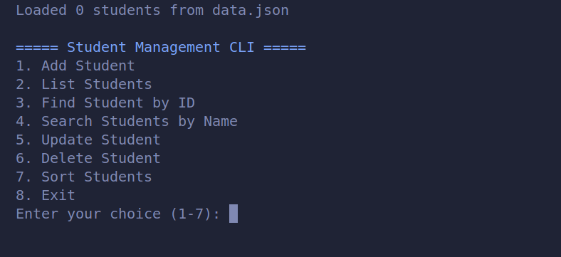

# CLI Student Management System

A **terminal-based student management system** built in **Python** using **OOP**, **logging**, **exception handling**, **input validation**, and **persistent JSON storage**. This project demonstrates a clean architecture, professional coding practices, and a user-friendly CLI interface.

---

## 🧩 Features

- **Add, List, Update, Delete Students**
- **Search students by ID or Name** (partial & case-insensitive search)
- **Sort students** by `id`, `name`, `age`, or `grade`
- **Data validation** using custom exceptions (`InvalidStudentDataError`)
- **Persistent storage** with `data.json`
- **Logging** for all actions in `app.log`
- **Colorful CLI** using `colorama` for better UX

---

## 📂 Project Structure

```
student_management/
│
├── main.py           # CLI menu and user interaction
├── student.py        # Student class & data validation
├── manager.py        # StudentManager class (CRUD + logging + persistence)
├── file_handler.py   # Handles saving/loading JSON data
├── data.json         # Auto-generated persistent storage file
├── app.log           # Logs all operations
└── README.md         # Project documentation
```

---

## ⚙️ Installation & Setup

1. Clone the repository:

```bash
git clone https://github.com/CioFlingar/CLI-student-management.git
cd cli-student-management
```

2. Create a virtual environment (recommended):

```bash
python -m venv .venv
source .venv/bin/activate  # Linux/macOS
.venv\Scripts\activate     # Windows

# You can also use poetry for this step.
```

3. Install required packages:

```bash
pip install -r requirements.txt
```

> `requirements.txt` should include:
>
> ```
> colorama
> ```

4. Run the program:

```bash
python main.py
```

---

## 🖥️ Usage

The menu will display options:

```
===== Student Management CLI =====
1. Add Student
2. List Students
3. Find Student by ID
4. Search Students by Name
5. Update Student
6. Delete Student
7. Sort Students
8. Exit
```

- Enter the corresponding number to perform actions.
- Inputs are validated to ensure correct data entry.
- All changes are automatically saved in `data.json`.
- Logs of all actions are stored in `app.log`.

---

## 🔧 Technologies & Concepts Used

- **Python 3.x**
- **Object-Oriented Programming (OOP)**
- **Exception Handling** (`InvalidStudentDataError`)
- **Logging** (`logging` module)
- **Persistent Storage** (`JSON`)
- **Terminal Colors** (`colorama`)
- **Type Hints** (`typing`)
- **Modular Code Structure** (separate files for Student, Manager, and FileHandler)

---

## 💡 Future Improvements

- Add **filtering by grade or course**
- Export data to **CSV or Excel**
- Implement **undo/redo last action**
- Add **authentication** for multiple users
- Integrate **unit tests** for better reliability

---

## 📸 Screenshots and ScreenCasts




_Will Be added soon..._

---

## 📄 License

This project is licensed under the **Me ;)**, Just kiddin.

---

## 🙌 Author

**Walid Hasan (CioFlinGar)**

- GitHub: [github.com/cioflingar](https://github.com/cioflingar)
- LinkedIn: [linkedin.com/in/walid-hasan-/](https://www.linkedin.com/in/walid-hasan-/)
- Email: [eng.walidhasan@gmail.com](mailto:eng.walidhasan@gmail.com)
